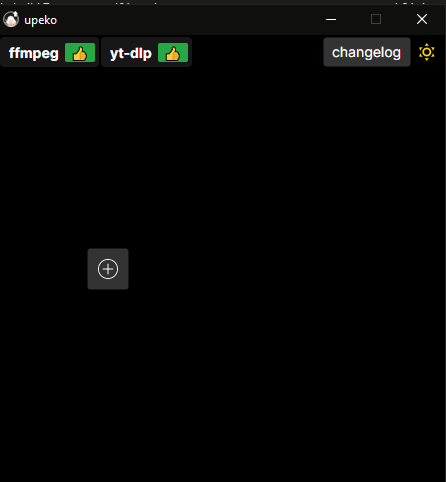
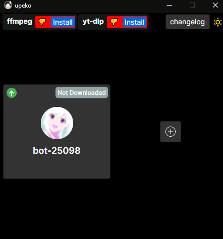
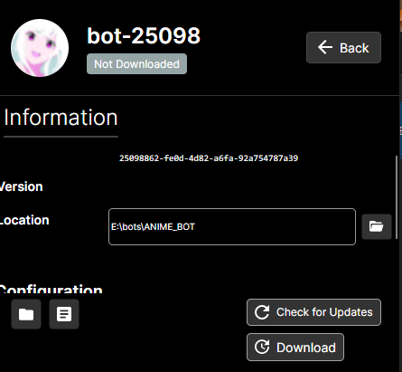
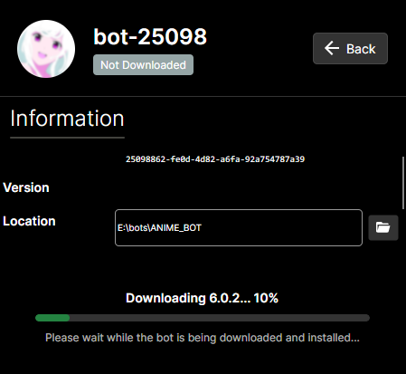
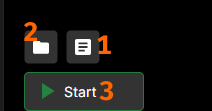

# NadekoBot Desktop Guide (via Upeko)

### Supported Operating Systems

--8<-- "md/snippets/supported-platforms.md"

---

??? note "Creating a Discord Bot & Getting Credentials"
    --8<-- "md/creds-guide.md"

---

## Setup

1. Download and run the [upeko](https://github.com/nadeko-bot/upeko/releases/latest).

    

2. Click the plus button to add a new bot

    

3. If you want to use the music module, click on **`Install`** next to `ffmpeg` and `yt-dlp` at the top
4. Click on the newly created bot

    

5. Click on **DOWNLOAD** at the lower right

    
    

6. When installation is finished, click on **`CREDS`** (`1`) above the **`RUN`** (`3`) button on the lower left
    - **`2`** simply opens your bot's data folder.
7. Paste in your **BOT TOKEN** previously obtained via [Creating a Discord Bot & Getting Credentials](#creating-your-own-discord-bot), then save your changes.

## Starting NadekoBot

- Either click on **`RUN`** button in the updater or run the bot via its desktop shortcut.

## Updating NadekoBot

!!! warning "IMPORTANT"

    - Make sure Nadeko is closed and not running
        - Run `.die` in a connected server to make sure.
    - Make sure you don't have `data` folder, bot folder, or any other bot file open in any program, as the updater will fail to replace your version

1. Run `upeko` if not already running
2. Click on your bot
3. Click on **`Check for updates`**
4. If updates are available, you will be able to click on the Update button
5. Click `Update`
6. Click `RUN` after it's done
