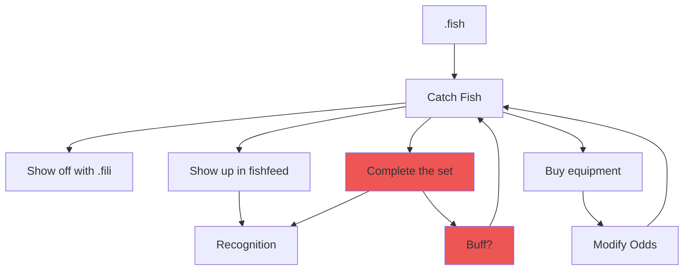

## Fishing

- Catch different kinds of fish in different locations
- Fish have
  - Rarity (how hard is it to catch?)
  - Quality (1-4 stars, higher stars less likely)
  - Spot (Where can they be caught)
  - Weather (Which weather conditions can they be caught in)
  - Time (What time of day can they be caught)

### Todo
  - Sets (sub collections)
    - Profile Badge or achievement?
    - Buff for each completed set?
  - Baits
    - Increase the odds of getting
      - Any Fish
      - Any Trash
      - Fish in weather
      - Fish in location
      - Rare Fish/Trash
      - Quality of the catch
      - Boost fishing speed?
        - Or this could be a separate consumable?
  - Reel in
    - If the fish is rare, or quality is high, require the user to reel it in

