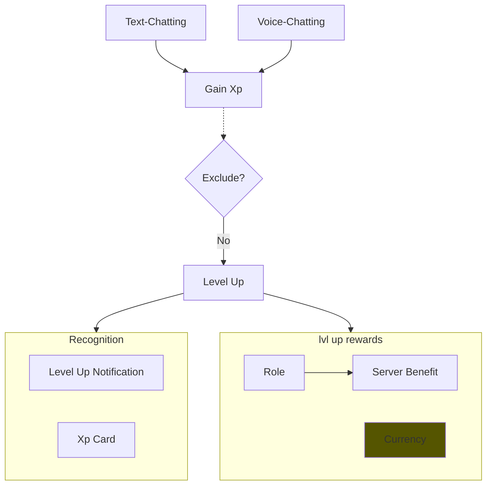

## Xp System

- Users in voice and text channels gain xp
- Users gain levels due to activity and receive rewards/recognition
- Server admin can 
  - Set Role Rewards
  - Exclude Users, channels and entire servers

### Todo

- Let users specify server currency rewards
- Server owner should be able to set xp rate on the server
- Remove global xp?

